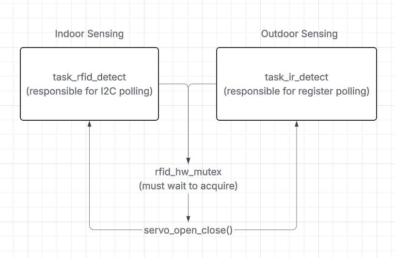

# ESP32-S3 Pet Door Authentication System

RFID (ISO14443A)-based access control system mounted onto an existing pet door, built on an ESP32-S3. A PN532 RFID module authenticates any authorized UIDs (temporarily) hardcoded into the binary. An IR break-beam sensor is situated on the inside portion of the door, preventing any locking while the pet passes through and/or second-guesses their decision of leaving or staying.

### Main Purpose

Provide a cheaper alternative to what's already on the market. Pets should not be expensive to maintain, and this project attempts to be an affordable alternative while trying its best to not compromise on safety. This system currently does not support remote logging/control, but this capability can (and likely will) be added in the near future to serve as a true alternative.

### Hardware Used

| Component | Notes |
|-----------|-------|
| ESP32-S3-DevKitC-1 v1.1 | Provides plenty of pins and Wi-Fi & BLE for feature expansion |
| PN532 NFC RFID Module | Uses I2C (lower pin count over SPI to expand with OLED display for general metrics) |
| IR Break Beam Sensor (5MM LEDs) | Low latency and high reliability in several lighting conditions |
| MG996R 55g Servo Motor | More reliable than the SG90 9g servo; used in conjunction with a rubber disk to slide door lock from opened to closed (and vice versa) |
| PetSafe Interior Cat Door, 2-Way Lock | 2 in. x 8 in. x 9 in.; used for demoing purposes since it provides a more secure locking mechanism than traditional outdoor flaps (see example here: https://m.media-amazon.com/images/I/71RT7vhWyOL._AC_SL1500_.jpg) |
| 10kOhm Resistor (x1) | Acts as pull-up for IR voltage sensing line; prevents floating input |

### Architecture

I decided to use FreeRTOS just to learn more about its API calls, and later found out that it would be highly important for future logging-based tasks. In the meantime, two tasks run with the shared mutex in order to protect each of their critical sections.

* **task_rfid_detect**: polls the PN532 sensor for any nearby tag and compares its UID against the allowlist to decide whether to unlock the door or not. This task must also use the IR break beam while running successfully.
* **task_ir_detect**: polls the IR break-beam GPIO6 register to wait for a trigger while the door is locked. This is to unlock the door while the cat is indoors, skipping unnecessary authentication.
* **rfid_hw_mutex**: the winning task will hold this mutex for the full duration of a lock/unlock cycle to prevent the other task from acting on a stale sensor state mid-transaction. **IMPORTANT NOTE: task_ir_detect was made to re-check its trigger condition (logic 0 in GPIO6) immediately after acquiring the mutex, since the condition would have been resolved by task_rfid_detect while waiting.**

<div style="text-align: center;">
  
</div>

### Building and Flashing
This project was tested using ESP-IDF v5.5.3 (either through the VSCode extension or esptools). To build and flash:
```shell
idf.py set-target esp32s3
idf.py build
idf.py -p <PORT> flash monitor
```

### Current Project Structure
```shell
main/
├── main.c              # app_main, task/mutex setup
├── inc/
│   ├── main.h          # all shared includes
│   ├── door_control.h  # servo and IR task declarations
│   └── pn532_rfid.h    # RFID task declarations
├── door_control.c      # servo init, IR init, servo_open_close
└── pn532_rfid.c        # PN532 init, RFID task, UID parsing
```

### To-Do (Future Development)
* Upgrade allowlist to NVS (non-volatile storage) for adding new tag UIDs during run-time
* Consider Mifare DESFire (or any similar challenge-response authentication scheme) over the current static UID comparison
* Add IR signal debounce for more reliability